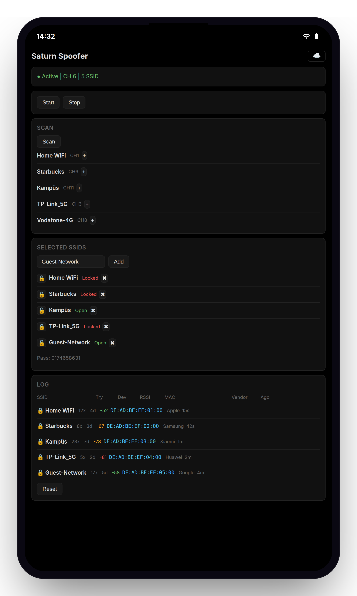
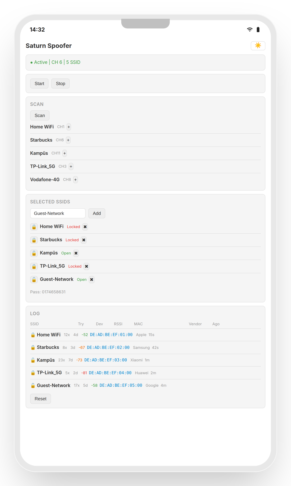

# ESP32 SSID Spoofer Pro

A web-controlled SSID beacon flooding tool for ESP32 with connection attempt logging and per-SSID lock toggling. Built with ESP-IDF framework.

## Features

- **Web-based Control Panel** — Professional dark UI, no app needed
- **WiFi Network Scanner** — Scan and clone nearby SSIDs
- **Per-SSID Lock Toggle** — Switch each SSID between open (🔓) and WPA2-protected (🔒)
- **Connection Attempt Logging** — Captures Probe/Association Requests via promiscuous mode
- **Device Identification** — OUI-based vendor lookup (Apple, Samsung, Xiaomi, etc.)
- **RSSI Tracking** — Real-time signal strength per SSID with color-coded badges
- **Real-time Status** — Active/inactive, channel, SSID count
- **WPA2 Protected AP** — Secure control interface with password

## Hardware Requirements

- ESP32 Development Board (ESP32-WROOM-32, ESP32-WROVER, etc.)
- USB cable for programming
- 4MB flash recommended

## Software Requirements

- PlatformIO CLI (no ESP-IDF install needed)
- Python 3.8+

## Installation

### 1. Clone & Build

```bash
git clone https://github.com/poqob/esp32-ssid-spoofer-pro.git
cd esp32-ssid-spoofer-pro
pio run -t upload
```

### 2. Connect to ESP32

- **SSID**: `saturn`
- **Password**: `kova3210`

### 3. Open Control Panel

**http://192.168.4.1** — Scan networks, add SSIDs, toggle locks, monitor connection attempts.

## Web UI

<p align="center">
  
  &nbsp;&nbsp;&nbsp;
  
</p>

- **Status bar**: Shows active/inactive state, channel, SSID count
- **Scan**: Discover nearby APs and add them to your spoof list
- **Selected SSIDs**: Toggle lock (🔒 WPA2 / 🔓 open), remove SSIDs
- **Log table**: SSID, attempt count, device count, RSSI (color-coded: green/orange/red), last MAC address + vendor, time since last seen
- **Reset**: Clear all log counters

## Lock Feature

Each SSID has an independent lock state:
- **Locked** (🔒): Beacon includes RSN IE (WPA2-AES-CCMP + PSK) — phone shows padlock
- **Unlocked** (🔓): Open beacon (no security IE)
- **Static password**: `0174658631`

## Connection Attempt Logging

- Promiscuous mode captures Probe Requests and Association Requests
- Only SSIDs in your spoof list are tracked — others silently dropped
- Per-SSID aggregated stats: attempt count, unique devices (up to 16 MACs), last RSSI, last MAC, OUI vendor
- OUI lookup table covers 100+ vendor prefixes (Apple, Samsung, Xiaomi, Huawei, Google, etc.)

## API Endpoints

| Method | Path | Description |
|--------|------|-------------|
| GET | `/` | Web UI (inline HTML) |
| GET | `/api/scan` | Scan nearby APs |
| GET | `/api/select` | List selected SSIDs |
| POST | `/api/select` | Add SSID `{ssid, channel}` |
| DELETE | `/api/select/delete?i=N` | Remove SSID at index |
| GET | `/api/log` | Connection attempt logs (RSSI, MAC, vendor) |
| POST | `/api/log/reset` | Reset all log counters |
| POST | `/api/toggle-lock` | `{i: index}` toggle lock |
| POST | `/api/spoof/start` | Start beacon flooding |
| POST | `/api/spoof/stop` | Stop beacon flooding |
| GET | `/api/status` | `{active, channel, count}` |

## Configuration

Edit `src/config.h`:

```c
#define AP_SSID       "saturn"     // Control AP SSID
#define AP_PASS       "kova3210"   // Control AP password
#define AP_CHANNEL    1            // AP channel
#define MAX_SSID      20           // Max SSIDs in spoof list
#define BEACON_BURST  3            // Frames per SSID per cycle
#define BEACON_INTERVAL_MS 10      // Interval between SSIDs (ms)
```

## Project Structure

```
├── platformio.ini
├── CMakeLists.txt
├── src/
│   ├── CMakeLists.txt
│   ├── config.h          — Configuration constants
│   ├── main.c            — Entry point (app_main)
│   ├── wifi.c/h          — WiFi init (AP+STA mode)
│   ├── beacon.c/h        — Beacon frame builder, spoof task, promiscuous logging
│   └── web.c/h           — HTTP server, API handlers, inline web UI
└── README.md
```

## Key Implementation Details

- **Frame injection**: `esp_wifi_80211_tx(WIFI_IF_AP, frame, len, false)` with DMA-safe `malloc`'d buffers
- **Beacon frame**: SEQ=0, broadcast DA, unique SA/BSSID per SSID (DE:AD:BE:EF:idx:00), interval=100ms, capability=0x0421
- **Promiscuous callback**: Non-blocking mutex `xSemaphoreTake(mutex, 0)` — drops frame if HTTP task holds mutex
- **Channel**: Default 6, overridden per selected SSID during scan
- **Burst mode**: 3 frames per SSID per cycle, 10ms stagger

## Safety & Legal Disclaimer

This tool is intended for:
- Educational purposes
- Security research
- Authorized penetration testing
- Cybersecurity coursework

**DO NOT** use this tool to disrupt networks you don't own or violate local laws.

## License

MIT License
